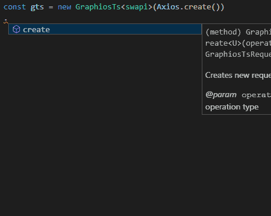

# GraphiosTs
GraphiosTs is TypeScript based GraphQl client built as an extension of Axios package. It combines the best from Axios and Typescript to provide lightweight alternative to the Apollo-client. GraphiosTs uses one GraphQl schema source to provide strongly typed requests and responses. In other words: **What you write, you will get**.



## Motivation

In the real world of programming, most of APIs, combines GraphQL and REST requests, so you need two separate clients. It puts complexity to handle two clients with similar settings and it is increasing bundle size. With GraphiosTs, you can share this logic with Axios via settings and interceptors. You have one client for both REST and GraphQl requests.

GraphiosTs translates GraphQl schema into GraphiosTs (TypeScript) schema. This schema is used for validation of graphql commands and compilation of result based on a command you write. Since GraphiosTs schema holds whole GraphQl logic of your endpoint, there is no need to run compilation every time, some GraphQl command has been changed in a script. With GraphiosTsCmd (downloads schema and translates it to GraphiosTs schema) you have only one source of truth... The server one. Every time GraphQl schema on the server will change, you can update GraphiosTs schema via command and Typescript will show you if something is wrong or incompatible.

This package does not try to compete Apollo ecosystem. Our main goal was to build simple, lightweight, strongly typed graphql client, which can be used in APIs, where every byte of boundle size counts. If you want full featured GraphQl client with tons of extensions and you don't care about size, take [Apollo-client](https://github.com/apollographql/apollo-client), which provides TypeScript definitions for results as well.

## Features
- **GraphQl client with features below**
- - [Support of query and mutation operation (Subscriptions will be added in next version)](https://graphql.github.io/graphql-spec/June2018/#sec-Language.Operations)
- - [Selection sets](https://graphql.github.io/graphql-spec/June2018/#sec-Selection-Sets)
- - [Fields](https://graphql.github.io/graphql-spec/June2018/#sec-Language.Fields)
- - [Arguments with Input values](https://graphql.github.io/graphql-spec/June2018/#sec-Language.Arguments)
- - [Field Aliases](https://graphql.github.io/graphql-spec/June2018/#sec-Field-Alias)
- - [Inline fragments](https://graphql.github.io/graphql-spec/June2018/#sec-Inline-Fragments)
- [Axios features](https://github.com/axios/axios).
- **Typings**
- - Strongly typed request constructor.
- - Generates strongly typed response from request constructor.
- - Uses only one schema -> single source of truth.
- - GraphQL schema can be downloaded from server and translated to GraphiosTs schema with GraphiosTsCmd.
- **Advanced requests**
- - Supports batched requests (multiple requests merged into one).
- - In next version we plan to add cache functionality as module.

## Pitfalls
### Missing features of GraphQl
GraphiosTs was designed to be strongly typed through Typescript only and there are some pitfalls in this approach. **Currently GraphiosTs does not support Directives and Variables. But this can be resolved with pure JavaScript functions, because of nature of GraphiosTs request, which is simple JS object**. 
### TypeScript
Inline Fragments are working properly, but when you use `isFragment` helper method, fake fragment definitions are still present. Those definitions are TypeSafed, so they can never occure, but for readability of definition, you have to use `getFragment` helper method to get really typesafed definition.

## Instalation

**This package is TypeScript ONLY**. Without TypeScript this package does not make much sense.

### Package
Using NPM:
```
npm install --save graphios-ts
```

### Bundle
We do not provide package bundle, because of the TypeScript nature of package.

## Example
Performing simple request
```typescript
import { GraphiosTs, isFragment , getFragment } from 'graphios-ts';
import { swapiSchema } from './swapi.graphQl';
import Axios from 'axios';


const gql = new GraphiosTs<swapiSchema>(Axios.create())
//Create new query
.create('query','OptionalName')
//GraphQl definition in GraphiosTs commands
.gql({
    //Name of query operation as a Field object
    'Film':{
        //It accepts arguments
        'args':{
            'id':'Foo',
            'title':'Bar'
        }
        //Payload is GraphQl Selection set.
        'payload':{
            //Scalars are defined by `true` value
            'id':true,
            //Field object without arguments
            'characters':{
                'payload':{
                    'id':true
                }
            },
            //Aliased value
            'alias':{
                '__type':'alias',
                'payload':{
                    'director':true
                }
            }
        }
    },
    'node':{
        'args':{
            'id':'Bar'
        },
        'payload':{
            'id':true,
            '__typename':true,
            '__onFilm':{
                '__type':'fragment',
                'payload':{
                    'director':true
                }
            }
        }
    }
})
/**
 * GraphiosTs will translate it into this Gql:
 * query OptionalName{
 *      Film(id:"Foo",title:"Bar"){
 *          id,
 *          characters{
 *              id
 *          },
 *          MovieMaker:director
 *      },
 *      node(id:"Bar"){
 *          id,
 *          __typename,
 *          ...on Film{
 *              director
 *          }
 *      }
 * }
 */
.request().then((data)=>{
    //Type safe data response
    console.log(data.Film.characters[0].id);
    //Type safe alias
    console.log(data.Film.MovieMaker)
    //Fragments
    //Helper method for selecting fragment
    if(isFragment(data.node,'__onFilm')){
        //Helper method for Type safe fragment definition
        const film = getFragment(data.node);
        //Type safed object.
        console.log(film.director);
    }
});
```

More examples [here](https://github.com/pavelstencl/GraphiosTs/tree/master/examples)


